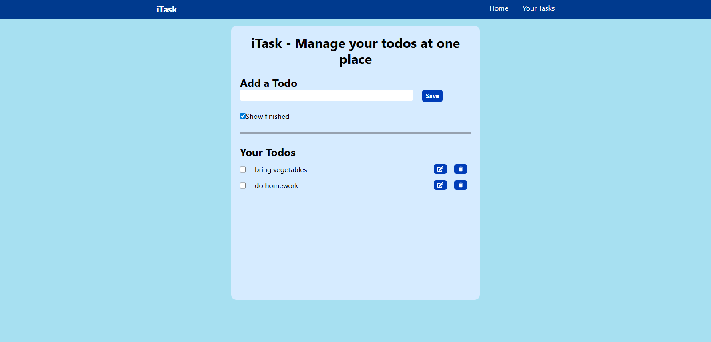

# iTask - Todo App

iTask is a simple and clean Todo application built with React. It helps you manage your daily tasks efficiently at one place.

## Features
- Add new todos
- Edit existing todos
- Delete todos
- Mark tasks as completed
- Option to show/hide finished tasks
- Clean and minimal UI design

## Technologies Used
- React.js
- Tailwind CSS

## Installation

1. Clone the repository:
   ```bash
   git clone https://github.com/KhushalPatel18/iTask.git
   cd iTask
   ```

2. Install dependencies:
   ```bash
   npm install
   ```

3. Start the development server:
   ```bash
   npm start
   ```

## Screenshot



---

### Future Improvements
- Add local storage support to save todos permanently
- Add due dates and reminders
- Add user authentication

